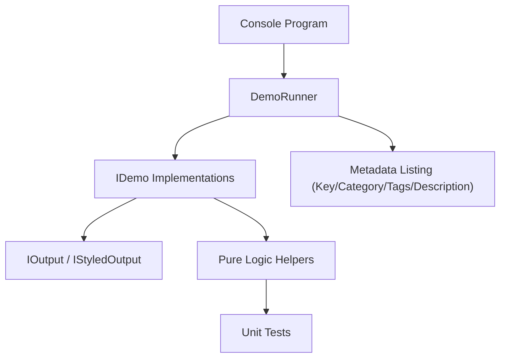

# System Overview Diagram

```mermaid
flowchart TD
  Program["Console Program"] --> Runner["DemoRunner"]
  Runner --> Demos["IDemo Implementations"]
  Demos --> Output["IOutput / IStyledOutput"]
  Runner --> List["Metadata Listing (Key/Category/Tags/Description)"]
  Demos --> Helpers["Pure Logic Helpers"]
  Helpers --> Tests["Unit Tests"]
```
