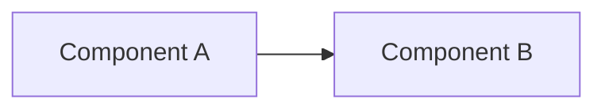

# Diagram Template

Copy this page when adding a new architecture diagram.

## Purpose

Describe what decision or runtime behavior this diagram explains.

## Mermaid Skeleton

## Source References

- Add links to the implementation files the diagram represents.
