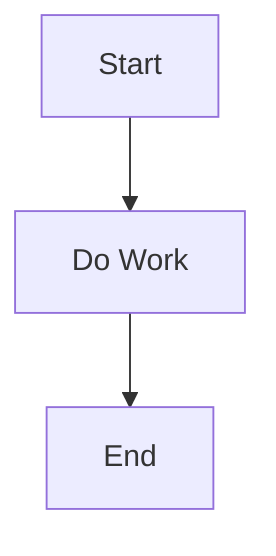

# Mermaid Authoring Checklist (Rider + MkDocs)

Use this checklist when writing Mermaid diagrams so they render consistently in Rider preview and the MkDocs site.

## Fast Rules

- Keep node labels short and plain ASCII where possible.
- Quote labels that include punctuation or parentheses.
- Prefer simple flowchart syntax over advanced styling when teaching concepts.
- Validate in both Rider preview and MkDocs before committing.

## Authoring Pattern

1. Start with a minimal graph that compiles:



2. Add one branch at a time and re-render after each change.
3. Only add classes/styles after the base graph is stable.

## Syntax Practices That Avoid Breakage

- Use explicit direction: `flowchart TD` or `flowchart LR`.
- Wrap complex labels in quotes: `A["Validate (Parse + Rule Check)"]`.
- Avoid raw HTML tags inside labels.
- Avoid semicolons inside labels unless quoted.
- Keep IDs simple: `A1`, `parse_input`, `result_ok`.

## Rider Preview Tips

- If preview looks stale, close/reopen Markdown preview.
- If Mermaid fails in Rider but works in MkDocs, keep the MkDocs result as source of truth.
- Use fenced blocks with exactly `mermaid` as the info string.

## MkDocs Validation Commands

Run from repo root:

```bash
cd /Users/scottpeterson/Dev/FizzBuzz/Scott.FizzBuzz
source .venv-docs/bin/activate
mkdocs build --strict
mkdocs serve
```

Site URL:

- [http://127.0.0.1:8000](http://127.0.0.1:8000)

## Troubleshooting

- Blank diagram:
  - Check for an unclosed quote or bracket.
- Partial rendering:
  - Remove newest edge/node and re-add incrementally.
- Works in editor, not in site:
  - Confirm block is fenced as `mermaid` and not indented into a code list context.

## Recommended Review Step for PRs

- For every changed Mermaid diagram, attach:
  - One Rider preview screenshot.
  - One MkDocs browser screenshot.
